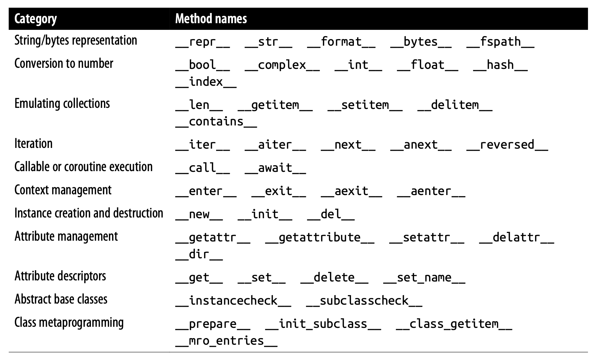
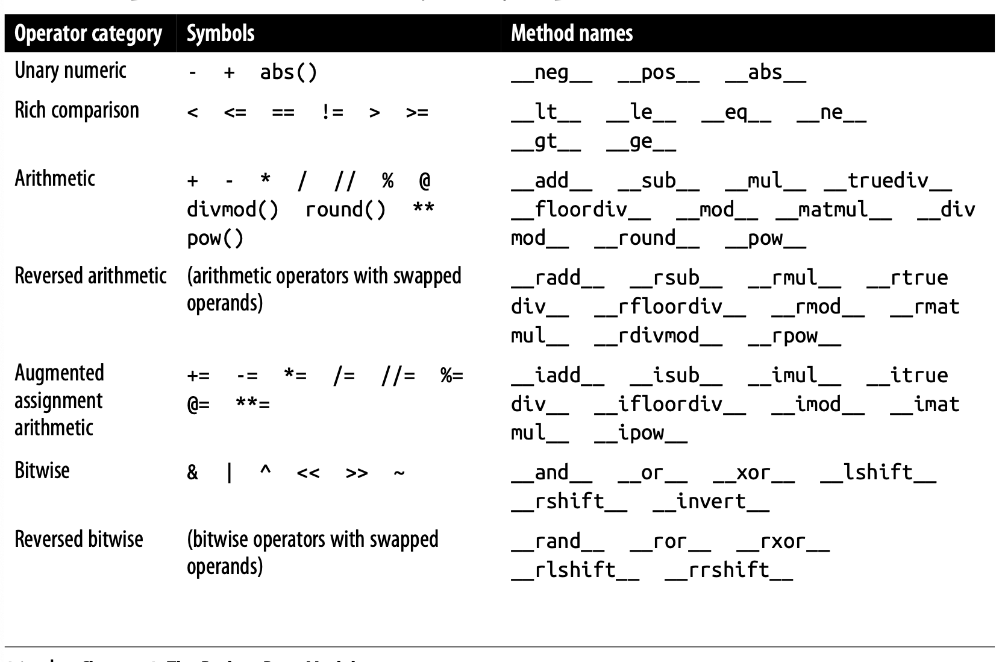

# Chapter 1: The Python Data Model

- **Python Data Model**: A framework that defines how objects behave in Python. It consists of a set of special methods (also called “dunder” or “magic” methods) that allow objects to integrate seamlessly with Python’s built-in features like iteration, operator overloading, and attribute access.

## A Pythonic Card Deck

- Special Methods:
    1. `__getitem__`: used to define the behavior of accessing elements via an index, `A[value]`.
    2. `__len__`: used to define the behavior of the `len()`function. 
    3. `__contains__`: defines the behavior of the in operator for checking membership in a collection.
        - keyword `in` calls the `__contains__` method.
            - Defaults to sequential scan (via a for loop) if the `__contains__` method is absent and the collections is iterable.
    4. `__repr__`: Used to return the string representation of the object for inspection. String should match the source code needed to recreate the represented object.
        - If `__repr__` is absent, printing the object would return the memory address `Vector object at 0x10e100070`.
    5. `__str__`: Used by the str() and print() functions and should be constructed to return a string suitable for displaying to end users.
        - If `__str__`is absent, Python will fall back on the `__repr__`to output a string to represent the object. 
    6. `__add__`: Used to in operator overloading, where the `+`operator is given a new meaning in relation to adding class objects together.
        - In context of the `Vector` class, `__add__`returns a new/resulting Vector object, the sum of 2 or more Vectors together.
    7. `__mul__`: Used in operator overloading, where the `*` operator is given a new meaning in relation to multiplying class objects together.
        - In context of the `Vector` class, `__mul__`returns a new/resulting Vector object, the product of 2 or more Vectors together.
    8. `__bool__`: By default user-defined classes are considered `True`. If `__bool__`is absent, Python will attempt to evaluate `len()`and return `True`if greated than 0. 

## How Special Methods Are Used

- Special methods should typically not be called directly by the programmer. Instead the should be used to define interactions of the object.
    - Programmers should call Python's built-in methods (len(), iter(), etc.) which are called by the special methods (`__len__`, `__iter__`, etc.).

- Overview of Special Methods: 

- Chapter Summary:

    1. Special methods allow custom objects (like the ones you create in your own classes) to behave similarly to built-in types like lists, dictionaries, or strings. This helps make code more expressive because you can use familiar operations (like addition, comparison, etc.) on your custom objects, just like you do with built-in types.
    2. `__repr__` and `__str__` are used to implement string representations of custom Python objects. 
        - `__repr__`: This method is meant to return a string that, ideally, could be used to recreate the object. It’s mostly for developers and debugging, so the string should show the object’s internal structure or details, often resembling the code that created it.
        - `__str__`: This method is for creating a more user-friendly, readable string representation. It’s what Python uses when you print an object or use str() on it. It’s more about how the object looks when you want to show it to the user, not for debugging.