# Dictionaries and Sets

## Modern dict Syntax

### dict Comprehensions

- `dictcomp`: Builds a `dict` instance by taking `key:value` pairs from any iterable. 

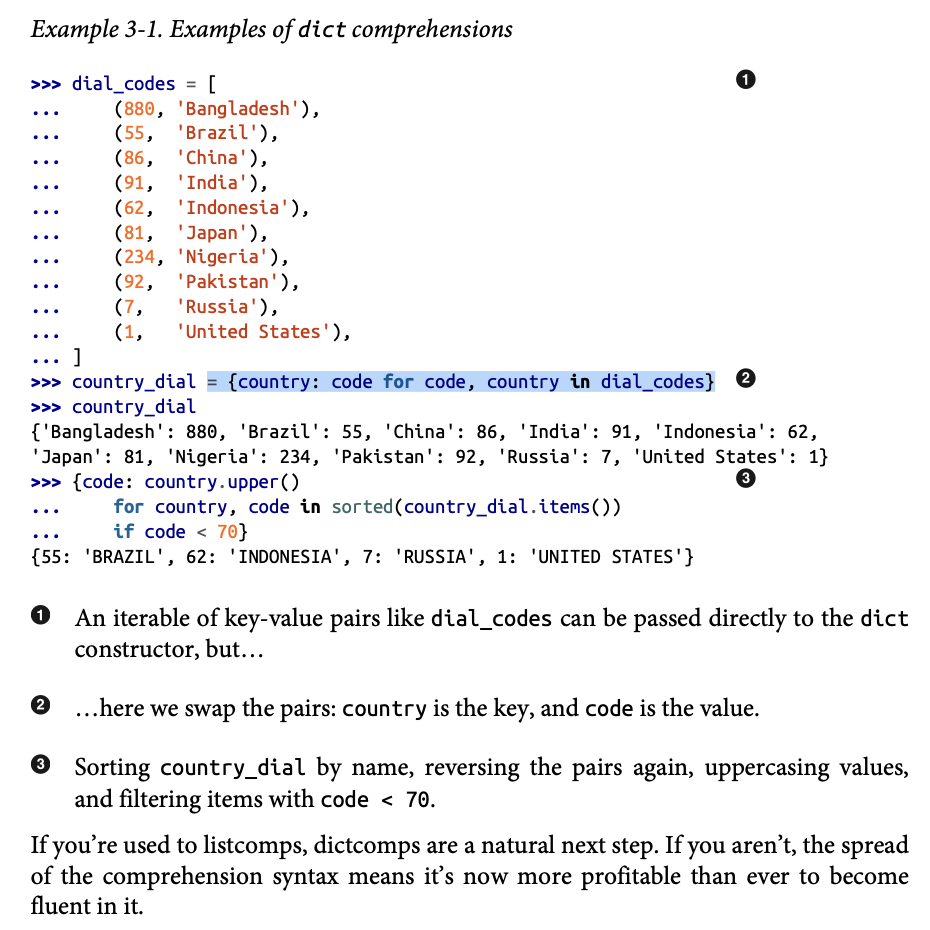

### Unpacking Mappings

- `**`: Can be applied to more than one argument in a function call to *unpack* a dictionary. Can be used to *merge* dictionaries together.

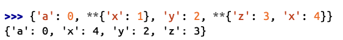

### Merging Mappings with |

- `|`: Can be used to merge dictionary mappings to a new dictionary. 

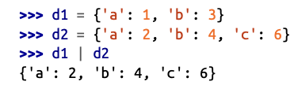

- `|=`: Used to merge dictionary mappings in-place.

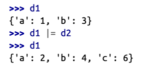

## Pattern Matching with Mappings

- 

### What is Hashable

- When is an object hashable?: If it has a hash code which never changes during its lifetime and can be compared to other objects.

### Overview of Common Mapping Methods

- Duck Typing: 

### Inserting or Updating Mutable Values

## Automatic Handling of Missing Keys

- `collections.defaultdict()`: The collections.defaultdict() is a subclass of the built-in dict that overrides one behavior: when accessing a missing key, it automatically creates an entry using a default factory function, instead of raising a KeyError.
    - default_factory: A callable (e.g., int, list, dict, set, or a custom function) that returns the default value for missing keys.

- `__missing__`: If you subclass dict, you can define a __missing__(self, key) method that gets called automatically when a key is not found.

## Variations of `dict`

- `collections.OrderedDict`: 

- `collctions.ChainMap`: *Chains* multiple dictionaries together into a single, referenceable view. When accessing a key, ChainMap searches each dictionary in order (from first to last) until it finds the key. It does not copy the dictionaries or their values—meaning it’s memory-efficient and reflects live updates to the original dicts.
    - Writing (e.g. assigning a new key-value pair) to the ChainMap affects only the first dictionary provided during instantiation.
    - Useful for managing layered configurations (e.g. default configs, environment overrides, user settings).

    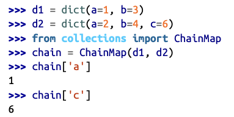

    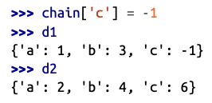

- `collections.Counter`: A mapping that holds an integer count for each key. Updating an existing key adds to
its count.
    - `most_common([n])`: returns an ordered list of tuples with the n most common items and their counts.  
    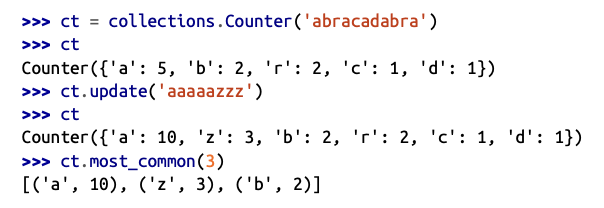

- `shelve.Shelf`: Is a dictionary-like object in Python that stores key-value pairs on disk, so the data persists between program runs. It allows you to use strings as keys and any picklable Python object as values.

### Subclassing UserDict Instead of dict   

## Immutable Mappings

- Mapping types provided by the standard library are all mutable, but the `Types` module provides a *wrapper* class called `MappingProxyType`, which, when given a mapping, return a **read-only** `mappingproxy` instance. 

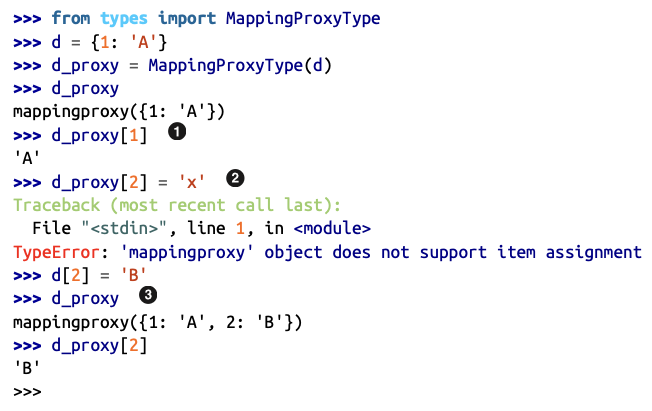

## Dictionary Views

- Read-only projections of the internal data structures used in the `dict` implementation.
    - A view object us a dynamic proxy. If the source `dict` is updated, these changes will be reflected in teh exisiting view. 

- `dict.keys()`: `dict` object instance method that returns instances of classes called `dict_items`. Just the `key`(s) are returned.
- `dict.values()`: `dict` object instance method that returns instances of classes called `dict_items`. Just the `value`(s) are returned.
- `dict.items()`: `dict` object instance method that returns instances of classes called `dict_items`. Both the `key` and the `value` are returned.
     

## Practical Consequences of How `dict` Works

## Set Theory

- `set`: a collection of unique objects.
- `frozenset`: an immutable version of a set object.
    - `frozenset(interable: list, set, or tuple)`

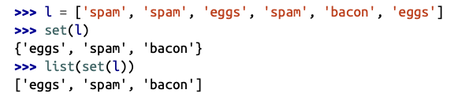

- Elements within a set must be *hashable*.
    - A `set` itself is not hashable, thus you cannot nest a `set` within a `set`.
    - However `frozenset` is hashable and can be added into a `set`. 

- `set` Operators (Given two `sets`, a and b):
    - `a | b`: Return the union of a and b.
        - Combines two or more `sets` into a single `set`, containing all unique elements involved in the `sets`.
    - `a & b`: Computes the intersection.
        - Returns a new set with common elements between two or more `sets`.
    - `a - b`: Computes the difference.
        - Returns a new set containing elements from the first set that are not present in the second set.
    - `a ^ b`: Computes the symmetric difference.
        - Returns a new set containing elements that are present in either of the two sets but not in both.

### Set Literals

- `set()`: Used to create an **empty** `set`.
    - `{}`: Used to create an **empty** `dict`.
- `{1, 2, 3, ...}`: Used to create a **nonempty** `set`.

### Set Comprehensions

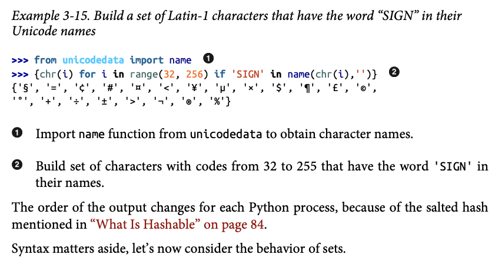

## Practical Consequences of How Sets Work

### Set Operations

## Set Operations and `dict` Views

- `dict.keys()` and `dict.items()` return values can interact with `set` operations.
    - NOTE `dict.items()` and `set` operations only work if ALL values with in the `dict` are hashable, TypeError raised.
    - By definition, `dict.keys()` are always hashable.

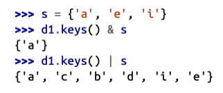

