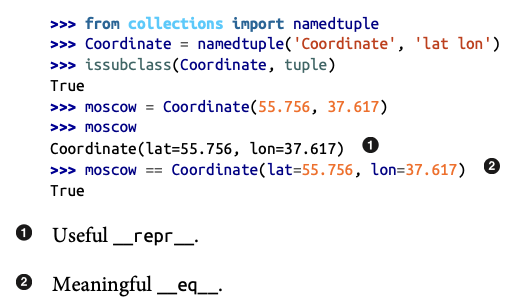
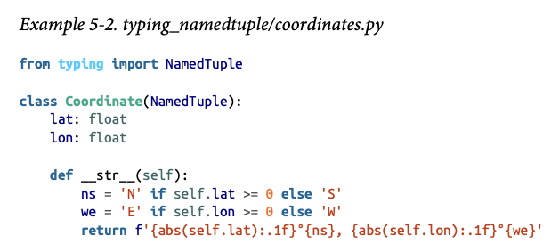
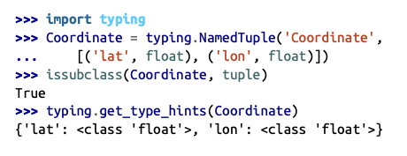
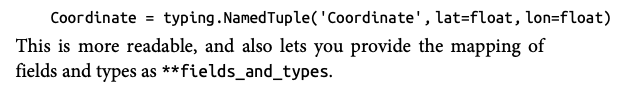
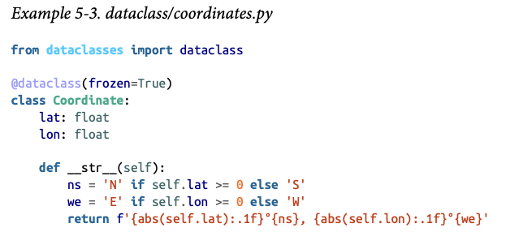
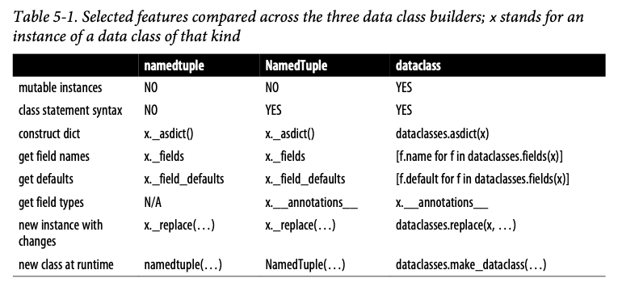
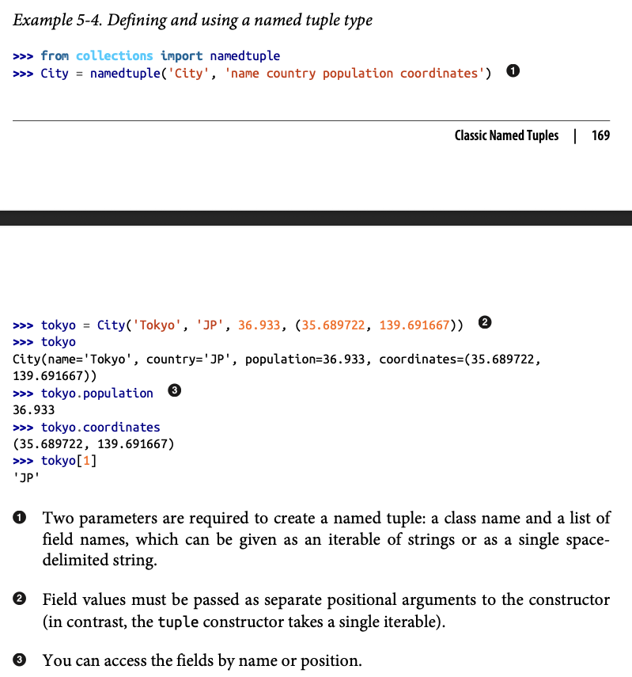

# Chapter 5: Data Class Builders

- Data Class: A simple class that is just a collection of fields, with little or no extra functionality.
    - `dataclasses`

- Code Smell: A coding pattern that may be a symptom of poor object-oriented design. 

## Overciew of Data Class Builders

1. `collections.namedtuple`: A factory function that builds a subclass of tuple with the name and fields you specify. 

2. `typing.NamedTuple`: Provides the same functionality as `collections.namedtuple`, also adding a **type annotation** to each field.
    - Can be used inside `class` statments and doesn't inherit from `NamedTuple`, but inherits from `tuple` type using the `typing.NamedTuple` metaclass functionality (chapter 24).
    

3. `@dataclass` decorator: The decorator reads the variable annotations and automatically generates methods for your class. 
    - Does not depend on inheritance or a metaclass. 

### Main Features

## Classic Named Tuples 

- `collections.namedtuple`: A factory that builds subclasses of `tuple` enhanced with field names, a class name, and __repr__. 
    - `defaults=`: The defaults= keyword argument allows you to specify default values for one or more fields (from the rightmost fields only).

## Typed Named Tuples

